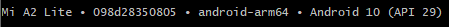

# hometraining
##### Version 0.1.2

A new Flutter application to training at home.

## Install Dependencies:
To install the project flutter dependencies run:<br>
```
$ flutter pub upgrade
```

## Run Code:
### 1. Verify devices
Check if your device is connected in your PC:<br>
```
$ flutter devices
```
Your device should appear, for example:<br>


### 2. Run App
Browse to root directory of project and run the follow code:
```
$ flutter run
```
If you have more than one device connected in your PC, run with the following code, using the Device ID that can be seen in code above.
```
$ flutter run -d deviceID
```
## App Execution:
### Run Training


### Complete Challenge


### Run Exercise


### Add New Training


### Edit Profile


## To Do
- [X] Save the own training 
- [X] Share done training
- [X] Share done challenge
- [X] Use Material/Cupertino design
- [X] Show Alerts Dialogs when necessary
- [ ] Put on Play Store
- [ ] Integration with Firebase
- [ ] Save data into SQFLite persistence
- [ ] Better UI
- [ ] Share training
- [ ] Group training
